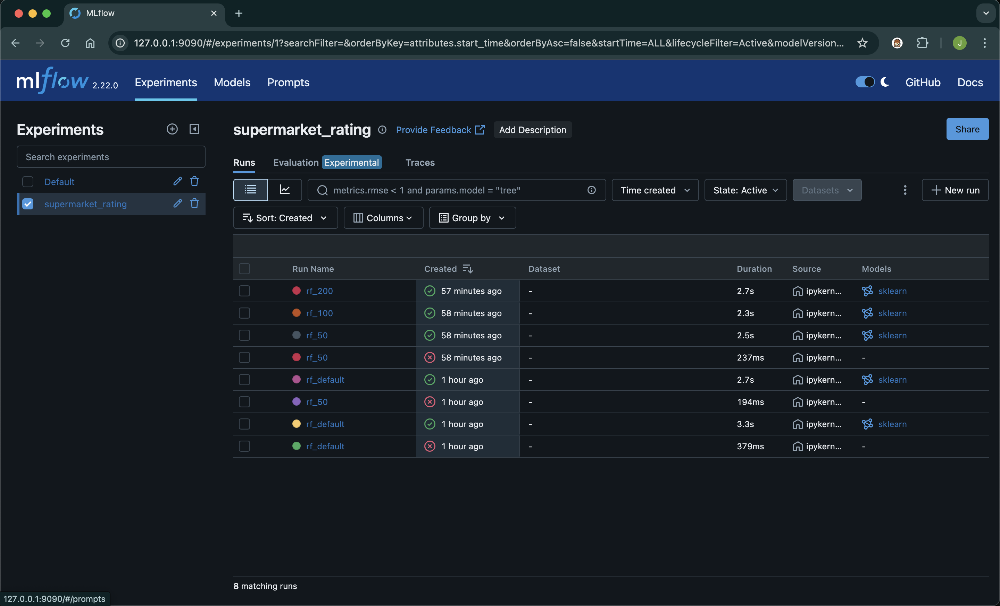
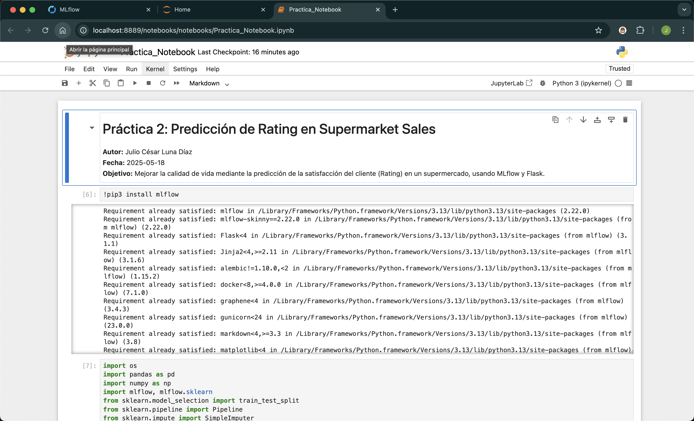

# Práctica 2: Predicción de Rating en Supermarket Sales

Este repositorio contiene la implementación completa de la Práctica 2, cuyo objetivo es **mejorar la calidad de vida** mediante la predicción de la satisfacción del cliente (`Rating`) en un dataset de ventas de supermercado. El flujo integrado abarca:

* **Dataset** optimizado
* **Entrenamiento y tuning** de modelo con MLflow
* **Registro** de experimentos y selección del best run
* **Despliegue** de un servicio web (Flask) para inferencia

---

## 📁 Estructura del proyecto

```text
practica2-mlflow-supermarket/
├── data/
│   └── SuperMarket Analysis.csv    # CSV fuente
├── notebooks/
│   └── practica2_supermarket_rating.ipynb  # Notebook con EDA y entrenamiento
├── flask_app/
│   └── app.py                      # Servicio Flask para /predict
├── best_run_id.txt                 # ID del mejor run en MLflow
├── mlruns/                         # Artefactos y metadata de MLflow
├── mlflow.db                       # Base de datos SQLite de tracking
├── requirements.txt                # Dependencias del proyecto
└── README.md                       # Documentación (este archivo)
└── payload.js                      # Documentao con ejemplo de datos para prueba de la predicción
```

---

## 🛠 1. Preparación del entorno

1. Clonar este repositorio:

   ```bash
   git clone https://github.com/tuusuario/practica2-mlflow-supermarket.git
   cd practica2-mlflow-supermarket
   ```
2. Crear y activar entorno virtual:

   ```bash
   python3 -m venv venv
   source venv/bin/activate
   ```
3. Instalar dependencias:

   ```bash
   pip install -r requirements.txt
   ```

---

## 🚀 2. Arrancar MLflow Server

En una terminal con el entorno activado:

```bash
mlflow server \
  --backend-store-uri sqlite:///mlflow.db \
  --default-artifact-root ./mlruns \
  --port 9090
```

* Accede a [http://localhost:9090](http://localhost:9090) para revisar experimentos.

---

## 📓 3. Notebook: EDA, entrenamiento y tuning

1. Abrir `notebooks/Practica_Notebook.ipynb` con Jupyter Notebook.
2. Celda por celda:

   * **Imports** y configuración de MLflow.
   * **Carga y EDA** del CSV.
   * **Preprocesamiento** (ColumnTransformer con numéricos y categóricos).
   * **Experimento inicial** (`rf_default`).
   * **Búsqueda de hiperparámetros** (`rf_50`, `rf_100`, `rf_200`).
   * **Selección de best run** y escritura de `best_run_id.txt`.

---

## 💻 4. Servicio Flask para inferencia

1. Asegurar que `best_run_id.txt` está en la raíz con el ID correcto.
2. Revisar `flask_app/app.py`:

   ```python
   import os, pandas as pd
   from flask import Flask, request, jsonify
   import mlflow, mlflow.pyfunc
   from mlflow.tracking import MlflowClient

   # Tracking URI a servidor MLflow
   mlflow.set_tracking_uri("http://localhost:9090")
   client = MlflowClient()

   # Ruta al run_id
   ROOT = os.path.dirname(os.path.dirname(os.path.abspath(__file__)))
   with open(os.path.join(ROOT, "best_run_id.txt")) as f:
       run_id = f.read().strip()

   # Buscar carpeta de artefacto del modelo
   artifacts = client.list_artifacts(run_id, path="")
   model_art = [f.path for f in artifacts if f.is_dir()][0]
   model_uri = f"runs:/{run_id}/{model_art}"
   model = mlflow.pyfunc.load_model(model_uri)

   app = Flask(__name__)
   @app.route("/predict", methods=["POST"])
   def predict():
       data = request.get_json()
       df = pd.DataFrame(data)
       # Si falta 'gross margin percentage', calcular:
       if "gross margin percentage" not in df:
           df["gross margin percentage"] = (df["gross income"] / df["cogs"]) * 100
       preds = model.predict(df)
       return jsonify({"predictions": preds.tolist()})

   if __name__ == "__main__":
       app.run(host="127.0.0.1", port=5001, debug=True)
   ```

---

## 📡 5. Probar la API

Se carga este JSON en `payload.json` junto a la raíz del proyecto:

```json
[
  {
    "Unit price": 74.69,
    "Quantity": 7,
    "Tax 5%": 26.1415,
    "Sales": 548.9715,
    "cogs": 522.83,
    "gross income": 26.1415,
    "gross margin percentage": 4.761905,
    "Branch": "Alex",
    "City": "Yangon",
    "Customer type": "Member",
    "Gender": "Female",
    "Product line": "Health and beauty",
    "Payment": "Ewallet"
  }
]
```

Luego, en otra terminal se activa el venv y ejecuta:

```bash
curl -v -i -X POST http://127.0.0.1:5001/predict \
  -H "Content-Type: application/json" \
  --data @payload.json
```

* Debe retornar **200 OK** y un JSON: `{"predictions":[8.36]}`.

---

## 6. Evidencias
### Interfaz de MLflow Server

*Figura 1: Interfaz web de MLflow mostrando el experimento `supermarket_rating` con todos los runs (`rf_default`, `rf_50`, `rf_100`, `rf_200`), sus métricas y artefactos.*

### Notebook de Jupyter con el código de la práctica

*Figura 2: Jupyter Lab abierto en `notebooks/practica2_supermarket_rating.ipynb`, con metadatos, imports y estructura de celdas para EDA, preprocesamiento y experimentos MLflow.*

### Prueba de la API de predicción vía curl

*Figura 3: Terminal donde se ejecuta `curl -X POST http://127.0.0.1:5001/predict --data @payload.json` y se recibe un `200 OK` con el JSON `{"predictions":[8.36]}`.*

